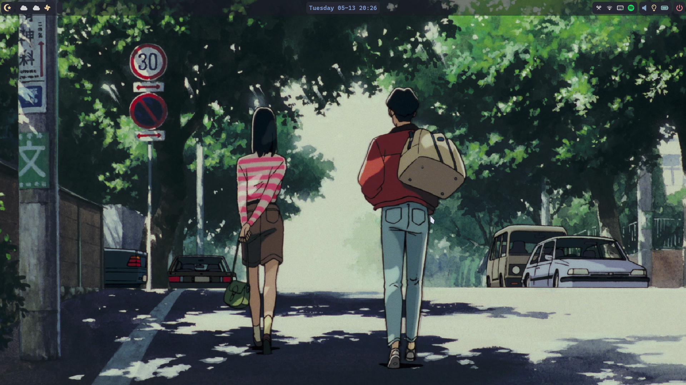

# Dots
***Notes***: The scripts and commands below should be used on Arch Linux, and I am not sure about other Linux distributions.

## Preview


## Required packages
```sh
pacman -S niri xdg-desktop-portal-gnome gnome-keyring xwayland-satellite
pacman -S hyprpaper hypridle hyprlock
pacman -S xdg-desktop-portal-gtk xdg-user-dirs pipewire wireplumber polkit-kde-agent
pacman -S kitty waybar dunst wofi network-manager-applet copyq
pacman -S pamixer playerctl pavucontrol pipewire-pulse helvum
pacman -S gammastep brightnessctl blueman udiskie
pacman -S nwg-look qt5ct qt6ct breeze breeze5 breeze-gtk
pacman -S qt5-wayland qt6-wayland
```
If you want to install required packages including fonts below, you can also use the `install.sh` script: 
```sh
git clone https://github.com/zhxqian3/dots.git
cd dots
sudo ./install.sh
```

### Fonts
```sh
pacman -S ttf-cascadia-code-nerd otf-font-awesome ttf-sarasa-gothic noto-fonts-emoji tela-circle-icon-theme-nord
```

### Cursor theme
[Nordzy-cursors](https://github.com/guillaumeboehm/Nordzy-cursors)

## Apply dotfiles
After install all required packages, and if you want to apply my dotfiles, just do:
```sh
pacman -S rclone
git clone https://github.com/zhxqian3/dots.git
cd dots
./apply.sh
```

## Credits
Thanks to:
- [1amSimp1e/dots](https://github.com/1amSimp1e/dots)
- [hyprland wiki](https://wiki.hyprland.org/)
- [Matt-FTW/dotfiles](https://github.com/Matt-FTW/dotfiles)
- [Yutsuten/linux-config](https://github.com/Yutsuten/linux-config)
- [TuxChad/wofi](https://github.com/TuxChad/wofi)
- [niri wiki](https://github.com/YaLTeR/niri/wiki)
